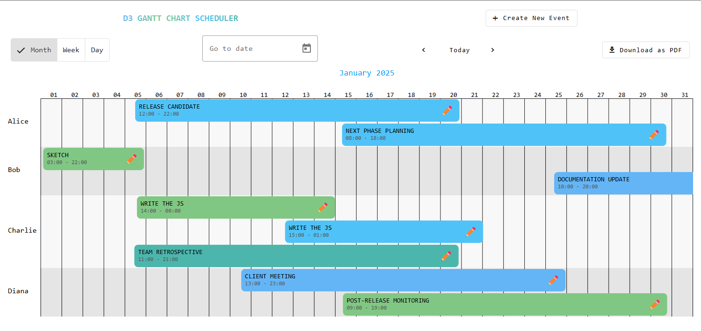
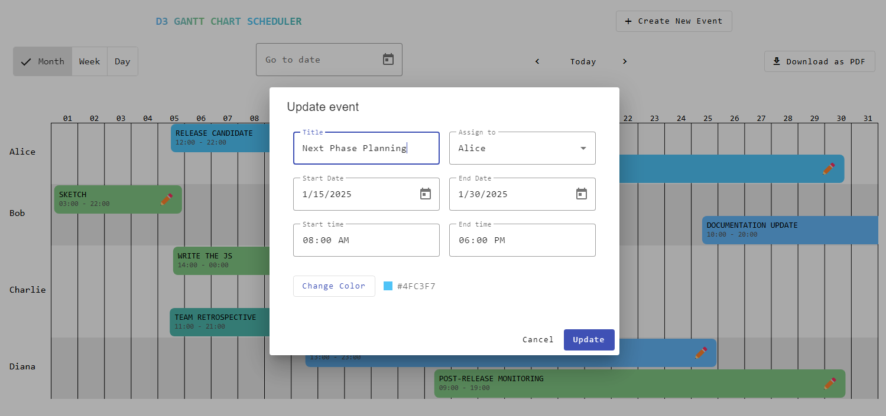

# :zap: D3 Gantt Chart Scheduler

* This app was generated with [Angular CLI](https://github.com/angular/angular-cli) version 19.0.6.
* This Gantt scheduler application is built with the latest version of Angular and leverages D3.js to create interactive Gantt charts. It offers three distinct views: daily, weekly, and monthly.

## :page_facing_up: Table of contents

* [:zap: GANTT]()
  * [:books: General info](#books-general-info)
  * [:camera: Screenshots](#camera-screenshots)
  * [:signal_strength: Technologies](#signal_strength-technologies)
  * [:floppy_disk: Setup](#floppy_disk-setup)
  <!-- * [:computer: Code Examples](#computer-code-examples) -->
  * [:cool: Features](#cool-features)
  * [:clipboard: Status & To-Do List](#clipboard-status--to-do-list)
  <!-- * [:file_folder: License](#file_folder-license) -->
  * [:envelope: Contact](#envelope-contact)

## :books: General info

* Enables users to create events, generate a PDF of the events, monitor different events assigned to different entities, and track progress through a fully responsive web interface.

## :camera: Screenshots

  
  

## :signal_strength: Technologies

* [Angular v19](https://angular.io/)
* [Angular Material](https://v19.material.angular.io/)
* [d3js](https://d3js.org/)

## :floppy_disk: Setup

* git clone `https://github.com/ermalCerhozi/scheduler.git`.
* Install dependencies using `npm install`.
* Run `ng serve`.
* Navigate to `http://localhost:4200/`. The app will automatically reload if you change any of the source files.

* If you want to modify the behavior of the Gantt, then you also need to run the `ng build scheduler --watch` command on another tab simultaneously

## :cool: Features

* Drag and drop Events.
* Download Gantt chart in PDF format.

## :clipboard: Status & To-Do List

* Status: Working.
* To-Do: Translations, Dark mode...

<!-- ## :file_folder: License

* This project is licensed under the terms of the MIT license. -->

## :envelope: Contact

* Repo created by [Ermal Cerhozi](https://github.com/ermalCerhozi), email: ermal.cerhozi3@gmail.com